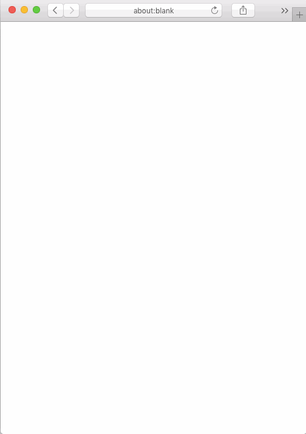

# WebCAS
[Do calculations in your browser](https://arve0.github.io/webcas/). Powered by [mathjs](http://mathjs.org).

## TODO

### Krav CAS matematikk R2
- [ ] bruke CAS til å regne både numerisk og symbolsk (algebraisk)
- [ ] løse likninger og ulikheter
- [ ] løse enkle eksponential- og logaritmelikninger
- [ ] løse likningssystemer
- [ ] forenkle uttrykk
- [ ] regne ut algebraiske uttrykk
- [ ] faktorisere algebraiske uttrykk
- [ ] polynomdivisjon
- [ ] løse likninger med hensyn på parametre i ulike problemstillinger
- [ ] derivere ulike funksjoner (første- og andrederivert)
- [ ] finne binomialkoeffisient og fakultet
- [ ] regne ut binomiske (kumulative) sannsynligheter
- [ ] regne ut hypergeometriske sannsynligheter
- [ ] vektorregning, skalarprodukt, vinkler, lengder
- [ ] bruke CAS til å regne med trigonometriske definisjoner og setninger i ulike problemstillinger
- [ ] kopiere beregninger fra CAS til et tekstbehandlingsdokument og eventuelt ta utskrift

Forslag til ny eksamensordning fra våren 2015 REA3022 Matematikk R1 Side 18 av 68
